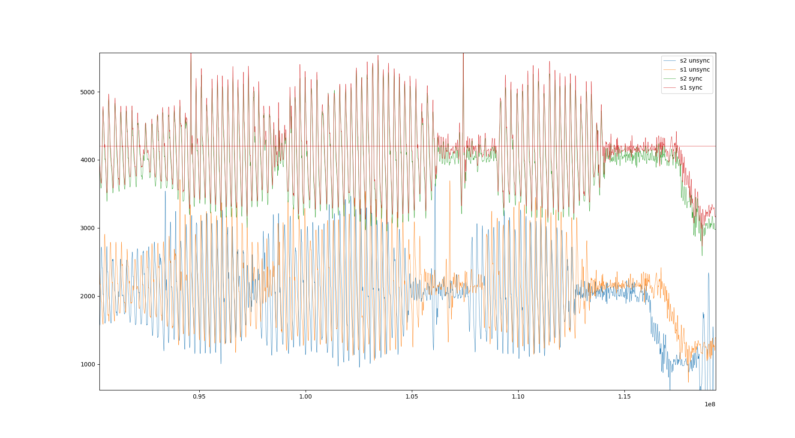

# EDL-TimeSync
Public Repository of our Electronic Design Lab Project Time Synchronization in Vibration Sensors under Prof. M.C. Chandorkar

Members:
1. Hrushikesh Loya (150010017@iitb.ac.in)
2. Rajat Patel (150010002@iitb.ac.in)
3. Yashswi Jain (150110039@iitb.ac.in)

### About

The project attempts to build a customizable skeleton which can be used to synchronise multiple sensors to take time stamped readings and transmit it to the user. 

We have developed a skeleton that can accommodate two vibration sensors (MMA7361, in our case) mounted on two self-designed and realised peripheral microcontrollers with ATMEGA-328P and a customised central Microprocessor for collecting the sampled and stamped data from both of them and sending them them to the UNIX PC for further analysis. 

### Board Design

You can find the eagle schematic and board files for both the central and peripheral microcontroller in Board Design folder.

### Communication Protocols

#### Mode 1 (CSS)
Continuous Sampling and Sending: The sampled data is sent to PC by each of the two Local Microprocessors alternatively. The sampling is done through interrupts and time spent in each interrupt service routine as mentioned above is 35 microseconds. This doesn’t affect the transmission as ATMEGA328p has 64 byte buffer for Serial transmission.
Maximum Attainable sampling rate: 2.5KHz

#### Mode 2 (Burst Mode)
Sampling till buffer is full and then sending in a burst: In this method we sample the data till the buffer is full and then send the data from 2 Local Microprocessors to the PC alternatively. The sampling of Data is stopped when the data is transmitted to PC. The sampling starts only after both the Local Microprocessors are done with the transmission.
Maximum Attainable sampling rate: 25KHz

### Time Synchronization

As the two peripheral microcontrollers have different clocks, there will be drifts in both the clocks after some time. To match the sampling instants, we use the same square wave which we sent from central for alternate data sending.

If there is drift in clocks, the timer1 (inbuilt timer in Atmega328P) values will not be same. So after certain number of cycles of square wave we set the the timer1 values of both the  microprocessors to initial values. And we send the timestamp when the synchronization is done to PC from Central Microprocessor. This way we acheive synchronized data.

### Firmware

##### How to upload the code?
Use Arduino IDE, to compile and upload the code. central.ino corresponds to central microprocessor, interrupt_transmit.ino corresponds to first peripheral, and interrupt_transmit2.ino corresponds to second peripheral.

##### Aquiring Serial Data on PC?
We use picocom (sudo apt-get install picocom) to aquire the serial data on ubuntu based PC. 
sudo picocom -b 230400 /dev/ttyUSB0 | tee logfile  (check your port on which arduino is connected, our case it was /dev/ttyUSB0)  saves the data from the serial port of the computer to a log file named logfile.

##### Plotting and Interpretting the data?
The data we recieve is in byte format.
You can then use log_reader_v1.py and log_reader_v2.py to plot the data aquired without time sync and with timesync respectively.

### Results

You can have a view of few of the amazing results (with their log files) we have obtained in the Results folder

Link to our complete report: https://docs.google.com/document/d/1JRsnFTGfe37P0LFT0vE4qM5fWR5oT6ynj_dwdIWIZMQ/edit?usp=sharing

Link to the final presenentation: https://docs.google.com/presentation/d/1-vB_suMupCKIn_ZJjNBb9ri4n2t6BEERArDRMrE7F0k/edit?usp=sharing

Refrences: 

1. "Time synchronization of a wired sensor network for structural health monitoring":  http://iopscience.iop.org/article/10.1088/0964-1726/17/01/015016

Chalte Hai!

